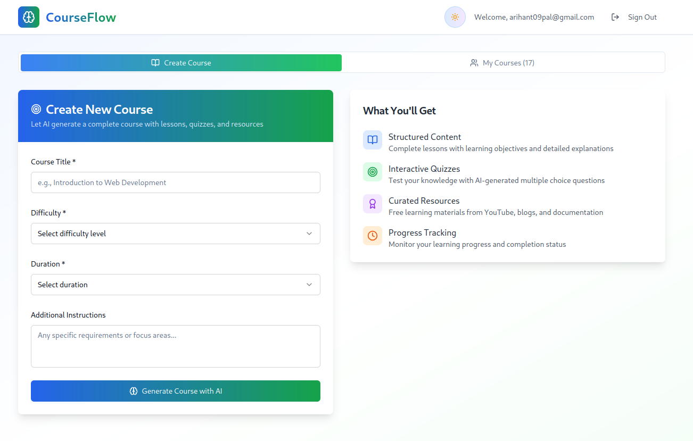
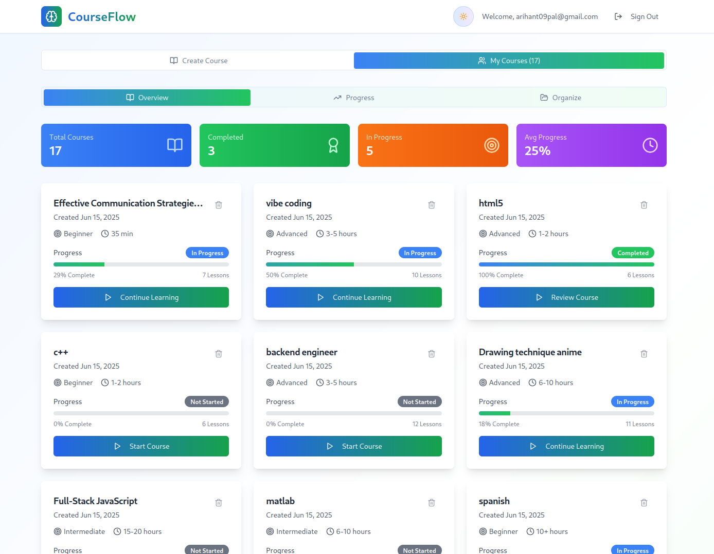
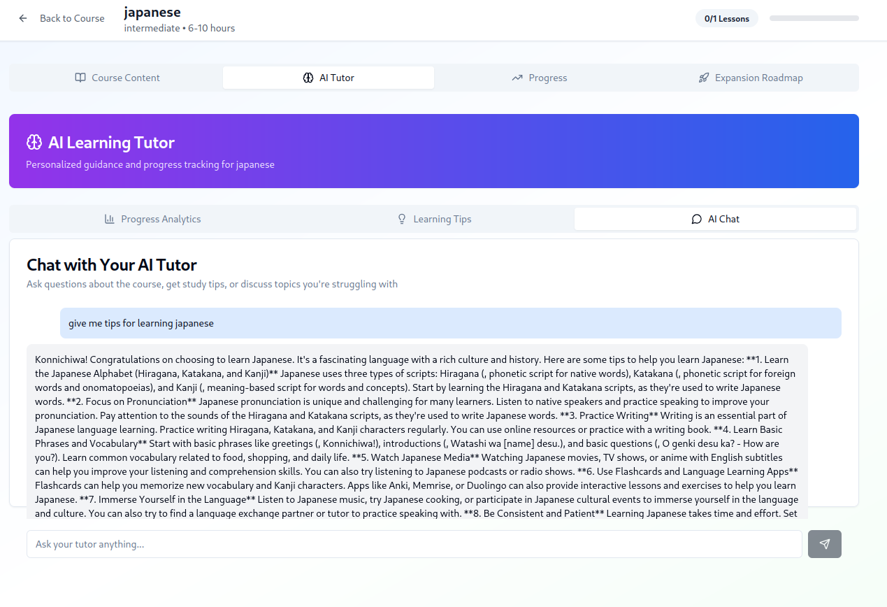
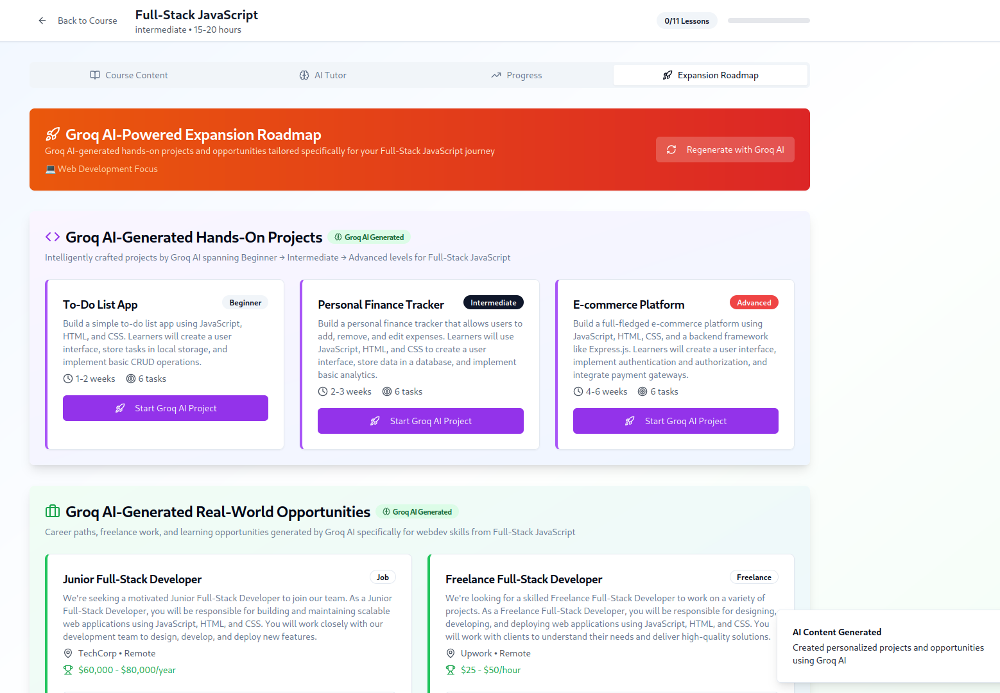

# 📚 AI Course Builder + Adaptive Learning Coach 🚀

An AI-powered SaaS prototype that generates fully personalized learning roadmaps, quizzes, and dynamically adapts based on each user's performance.
Built for hackathons, startups & edtech innovation.

---

## 📋 Table of Contents

1. 🧠 [What is this?](#what-is-this)
2. ✨ [Features](#features)
3. 📸 [Screenshots](#screenshots)
4. 🚀 [Installation & Setup](#installation--setup)
5. ⚙️ [Usage](#usage)
6. 🛠 [How It Works](#how-it-works)
7. 🌐 [Architecture](#architecture)
8. 🔌 [API Reference](#api-reference)
9. 🔧 [Environment Variables](#environment-variables)
10. 🐞 [Troubleshooting](#troubleshooting)
11. ❓ [FAQ](#faq)
12. 🤝 [Contributing](#contributing)
13. 📜 [License](#license)
14. 🌟 [Acknowledgments](#acknowledgments)

---

## 🧠 What is this?

This project solves one of the biggest problems in self‑learning:

> **"How do I know what to learn next, and whether I'm truly making progress?"**

CourseFlow empowers learners by:

* Generating fully custom courses & learning paths based on a simple prompt.
* Auto‑creating quizzes for each module to test comprehension.
* Providing AI‑powered feedback on quiz results, confidence levels, and written reflections.
* Dynamically adjusting the roadmap to focus on strengths and shore up weaknesses.
* Recommending real‑world projects and career opportunities aligned to each learner’s journey.
* Delivering weekly coaching messages to keep motivation high.

---

## ✨ Features

* **Personalized Roadmap Generation**
  Break down any skill goal into modules, topics, micro‑projects, and free resources.

* **AI‑Generated Quizzes**
  Multiple‑choice questions per lesson to reinforce learning.

* **Adaptive Feedback Loop**
  After every quiz, users submit confidence & reflections; AI analyzes performance and adjusts the path.

* **Project Recommendations**
  Hands‑on project suggestions tailored to each module to apply skills immediately.

* **Career Path Suggestions**
  Curated list of relevant internships, freelance gigs, and job roles matching the learner’s progress.

* **Progress Dashboard**
  Visualize completed modules, quiz scores, confidence trends, and upcoming goals.

* **Export & Share**
  Download your custom roadmap and progress report as PDF, Markdown, or shareable link.

---

## 📸 Screenshots

### 📌 Roadmap Generator



### 📌 Course Creation


### 📌 Adaptive Quiz Feedback



### 📌 Personalized Progress Dashboard



### 📌 Dynamic Roadmap Adjustment



---

## 🚀 Installation & Setup

1. **Clone the repository**

   ```bash
   git clone https://github.com/yourusername/courseflow.git
   cd courseflow
   ```

2. **Install dependencies**

   ```bash
   npm install
   ```

3. **Configure environment variables**
   Create a `.env` file in the root directory:

   ```env
   NEXT_PUBLIC_SUPABASE_URL=https://xyzcompany.supabase.co
   NEXT_PUBLIC_SUPABASE_ANON_KEY=your_anon_key
   SUPABASE_SERVICE_ROLE_KEY=your_service_role_key
   OPENROUTER_API_KEY=your_openrouter_api_key
   ```

4. **Run the development server**

   ```bash
   npm run dev
   ```

   Open [http://localhost:3000](http://localhost:3000) in your browser.

---

## ⚙️ Usage

1. **Sign Up / Log In**
   Create an account or sign in to access your dashboard.

2. **Create a New Course**

   * Enter the skill goal (e.g., “Learn React.js from scratch”).
   * Select your current level and weekly commitment.
   * Click **Generate Course** to receive your custom roadmap, lessons, quizzes, and resources.

3. **Work Through Modules**

   * Read lesson content.
   * Complete quizzes to test understanding.
   * Rate your confidence and reflect on struggles.

4. **Receive Adaptive Feedback**

   * AI analyzes your input and quiz scores.
   * Roadmap adjusts to focus on weaker areas.
   * Motivational coach messages guide your next steps.

5. **Explore Projects & Careers**

   * Browse hands‑on projects recommended for each module.
   * Discover relevant jobs, internships, and freelance opportunities.

6. **Export & Share**

   * Download your roadmap & progress report.
   * Share a public link with peers or mentors.

---

## 🛠 How It Works

1. **User Input**
   Learner describes their goal, level, and time availability.

2. **LLM Roadmap Generation**
   A crafted prompt is sent to Llama 3 via Groq Cloud, returning a structured JSON roadmap.

3. **Data Persistence**
   All courses, modules, quizzes, resources, and progress data are stored in Supabase.

4. **Quiz & Reflection**
   For each module, quizzes are auto-generated. Learners submit scores, confidence, and reflections.

5. **Adaptive Feedback**
   An LLM analyzes quiz results & reflections, identifies gaps, and outputs updated roadmap segments and motivational messages.

6. **Dynamic UI Rendering**
   React.js fetches from Supabase and renders interactive roadmaps (Mermaid.js) and progress dashboards in real time.

---

## 🌐 Architecture

```plaintext
+--------------+        +--------------+       +-----------+
|    Frontend  | <----> |  Backend API | <---->|  Supabase |
|  (React.js)  |        | (Node/Express)|      | (Postgres)|
+--------------+        +--------------+       +-----------+
        |                      |
        v                      v
  +--------------+       +-------------+
  |  Groq Cloud  |       |  OpenRouter |
  | (Llama 3 API)|       |   AI Proxy  |
  +--------------+       +-------------+
```

---

## 🔌 API Reference

### POST `/api/roadmap`

Generate a new learning roadmap.

**Request:**

```json
{
  "goal": "Learn Kubernetes",
  "level": "Beginner",
  "hoursPerWeek": 5
}
```

**Response:**

```json
{
  "courseId": "uuid",
  "modules": [ ... ]
}
```

---

### POST `/api/feedback`

Submit quiz results and get adaptive feedback.

**Request:**

```json
{
  "courseId": "uuid",
  "moduleId": "uuid",
  "score": 7,
  "confidence": 3,
  "reflection": "Found networking concepts tough"
}
```

**Response:**

```json
{
  "weakTopics": [ ... ],
  "suggestedResources": [ ... ],
  "updatedModules": [ ... ],
  "coachMessage": "Great job! Let's review..."
}
```

---

## 🔧 Environment Variables

| Name                            | Description                                  |
| ------------------------------- | -------------------------------------------- |
| `NEXT_PUBLIC_SUPABASE_URL`      | Your Supabase project URL                    |
| `NEXT_PUBLIC_SUPABASE_ANON_KEY` | Supabase anon public key                     |
| `SUPABASE_SERVICE_ROLE_KEY`     | Supabase service role key (server-side only) |
| `OPENROUTER_API_KEY`            | API key for OpenRouter to access LLM models  |

---

## 🐞 Troubleshooting

* **Invalid JSON from AI:**
  Ensure prompts are correctly formatted and rate limits haven't been exceeded.
* **Supabase connection errors:**
  Verify your URL and keys in `.env` and that your IP is allowed in Supabase settings.
* **Deployment issues:**
  Check logs on Vercel/Railway, and ensure environment variables are set in the platform.

---

## ❓ FAQ

**Q: Can I customize the quiz length or difficulty?**
A: Yes—modify the prompt in `/prompts/roadmap_prompt.txt` to adjust quiz parameters.

**Q: How do I add more resource types?**
A: Update the AI prompt to include additional resource categories (e.g., podcasts, GitHub repos).

**Q: Is user data secure?**
A: All data is stored in Supabase with row-level security. Service keys are only used server-side.

---

## 🤝 Contributing

We welcome your contributions! To get started:

1. Fork the repo
2. Create a new branch (`git checkout -b feature/YourFeature`)
3. Make your changes and commit (`git commit -m 'Add feature'`)
4. Push (`git push origin feature/YourFeature`)
5. Open a Pull Request

Please ensure code style consistency and update/add tests where appropriate.

---

## 📜 License

This project is licensed under the MIT License. See [LICENSE](LICENSE) for details.

---

## 🌟 Acknowledgments

* **Supabase** for seamless backend services.
* **Groq Cloud** for blazing-fast LLM inference.
* **OpenRouter** for simplified AI API access.
* **Mermaid.js** for roadmap visualizations.
* Inspiration from learners worldwide striving for continuous improvement.
